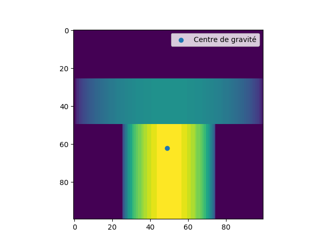
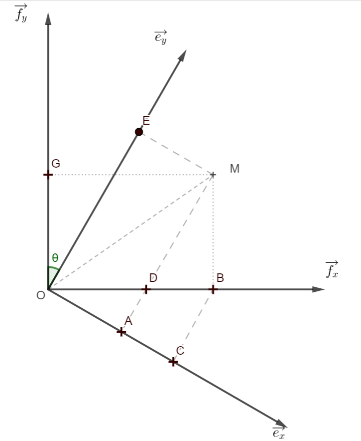
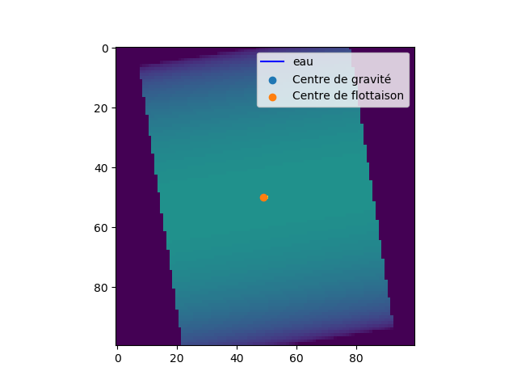

# Centre de Gravité et de Flottaison

## 1 - Rectangle Triple
1- On a :

$$\int_{x=0}^1 \int_{y=0}^1 \int_{z=0}^1 \frac {xy} {1+y^2} dzdydx $$

<p align="center"></p>

<p align="center"></p>
<p align="center"></p>

2-


3- 
```python
def integrale_triple(f,xmin,xmax,ymin,ymax,zmin,zmax,N=100):
    """
        Entrée :    - f : [xmin,xmax]*[ymin,ymax]*[zmin,zmax] -> |R

        Sortie : 	-int ou float : Valeur de l'intégrale triple de f
    """

    dx = (xmax-xmin)/N
    dy = (ymax-ymin)/N
    dz = (zmax-zmin)/N

    res=0
    for i in range(0,N):
        for j in range(0,N):
            for k in range(0,N):
                res+=f(xmin+i*dx,ymin+j*dy,zmin+k*dz)*dx*dy*dz
                
    return res
```

4-

5- 
```python
def volume(rho,xmin,xmax,ymin,ymax,zmin,zmax):
    """
            Entrée :    - rho : [xmin,xmax]*[ymin,ymax]*[zmin,zmax] -> |R

            Sortie : 	-int ou float : Valeur de l'intégrale triple de f
    """ 
    def f_indicatrice(x,y,z):
        """
        Indique si le point A(x,y,z) est dans le solide (Si oui -> 1 sinon -> 0) 
        """
        if rho(x,y,z)==0:
            return 0
        else:
            return 1
        
    volume = intégrale_triple(f_indicatrice,xmin,xmax,ymin,ymax,zmin,zmax)
    return volume
```

## 2 - Centre de gravité

1 -
```python
def masse(rho,xmin,xmax,ymin,ymax,zmin,zmax):
    """
            Entrée :    - rho : [xmin,xmax]*[ymin,ymax]*[zmin,zmax] -> |R

            Sortie : 	- int ou float : masse du solide
    """ 
    return intégrale_triple(rho,xmin,xmax,ymin,ymax,zmin,zmax)

```

2 - 
```python
def centre_grav(rho,xmin, xmax, ymin, ymax, zmin, zmax):
    """
            Entrée :    - rho : [xmin,xmax]*[ymin,ymax]*[zmin,zmax] -> |R

            Sortie : 	- Triplet (int ou float) : Coordonnées du centre de gravité
    """

    m = 1/(masse(rho,xmin,xmax,ymin,ymax,zmin,zmax))
    Gx=m*intégrale_triple(lambda x,y,z:x*rho(x,y,z),xmin,xmax,ymin,ymax,zmin,zmax)
    Gy=m*intégrale_triple(lambda x,y,z:y*rho(x,y,z),xmin,xmax,ymin,ymax,zmin,zmax)
    Gz=m*intégrale_triple(lambda x,y,z:z*rho(x,y,z),xmin,xmax,ymin,ymax,zmin,zmax)
    return (Gx,Gy,Gz)

```


## 3 - Centre de gravité

1 -


D'après le théorème de Thales, on a :
$$ \frac {OD} {OB}=\frac {OA} {OC}$$
Or $$ OC = x\cos\theta$$ 
$$ OD = x- y\tan\theta$$
Donc 
$$x' = \frac {(x-y\tan\theta)(x\cos\theta)} {x}= x \cos\theta - y\sin\theta
$$
Avec le théorème de Pythagore, on obtient
$$
y'= x^2+y^2-(x\cos\theta-y\sin\theta)
$$

2 - 
```python
def coord_R1_vers_coord_R0(x,y,z,theta):
    """ 
            Entrée : 	- x,y,z : Coordonnées dans R1
                        - theta : Angle entre fy et ey
                        
            Sortie : 	- Triplet (int ou float) : coordonnées dans R0
    """

    c,s = np.cos(theta), np.sin(theta)
    return (x*c-y*s,x**2+y**2-(x*c-y*s)**2,z)
```

3 -
```python
def un_dans_leau_et_dans_X(x,y,z,rho,theta,h):
    """
            Entrée : 	- x,y,z : Coordonnées dans R0
                        - rho : [xmin,xmax]*[ymin,ymax]*[zmin,zmax] -> |R
                        - theta : Angle entre fy et ey
                        - h : Niveau de la surface de l'eau
                        
            Sortie : 	- 1 : Si le point est dans le solide et sous l'eau
                        - 0 : Sinon
    """
    _,y1,_ = coord_R1_vers_coord_R0(x,y,z,theta)
    if rho(x,y,z) != 0 and y1<h:
        return 1
    else:
        return 0
```
4 - 
```python
def volume_immergé(rho, theta, h, xmin, xmax, ymin, ymax, zmin, zmax):
    """
            Entrée :    - rho : [xmin,xmax]*[ymin,ymax]*[zmin,zmax] -> |R
                        - theta : Angle entre fy et ey
                        - h : Niveau de la surface de l'eau

            Sortie : 	-int ou float : volume immergé
    """   
    return intégrale_triple(lambda x,y,z: un_dans_leau_et_dans_X(x,y,z,rho,theta,h),xmin,xmax,ymin,ymax,zmin,zmax)


def centre_flott(rho, theta, h, xmin, xmax, ymin, ymax, zmin, zmax):
    """
            Entrée :    - rho : [xmin,xmax]*[ymin,ymax]*[zmin,zmax] -> |R
                        - theta : Angle entre fy et ey
                        - h : Niveau de la surface de l'eau	

            Sortie : 	- Triplet (int ou float) : Coordonnées de centre de flottaison
    """  
    V = 1/(volume_immergé(rho,theta,h,xmin,xmax,ymin,ymax,zmin,zmax))
    Fx = V*intégrale_triple(lambda x,y,z: x*un_dans_leau_et_dans_X(x,y,z,rho,theta,h),xmin,xmax,ymin,ymax,zmin,zmax)
    Fy = V*intégrale_triple(lambda x,y,z: y*un_dans_leau_et_dans_X(x,y,z,rho,theta,h),xmin,xmax,ymin,ymax,zmin,zmax)
    Fz = V*intégrale_triple(lambda x,y,z: z*un_dans_leau_et_dans_X(x,y,z,rho,theta,h),xmin,xmax,ymin,ymax,zmin,zmax)
    
    return (Fx,Fy,Fz)
```


5 - 

```python
def centre_grav_R1(rho,xmin,xmax,ymin,ymax,zmin,zmax,theta):
    """
            Entrée :    - rho : [xmin,xmax]*[ymin,ymax]*[zmin,zmax] -> |R
                        - theta : Angle entre fy et ey
                        
            Sortie : 	- Triplet (int ou float) : Coordonnées du centre de gravité dans R1
    """  
    x,y,z = centre_grav(rho,xmin, xmax, ymin, ymax, zmin, zmax)
    x,y,z = coord_R0_vers_coord_R1(x,y,z,theta)
    return (x,y,z)
```


